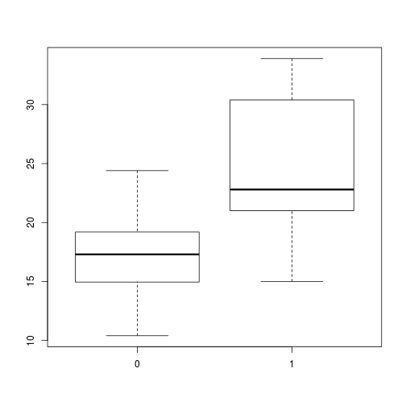

Two sample t-test: Coursera Developing Data Products Project
========================================================
author: Stefan Faußer
date: 15th May 2016
autosize: true

Introduction
========================================================

- Ever wanted to do exploratory hypothesis testing with a few clicks?
- Try out my two sample t-test shiny application!
- Where to find
    - shiny Webapp: <https://stefanfausser.shinyapps.io/t-test/>
        - Source code: <https://github.com/stefanfausser/DevelopingDataProducts-CourseProject/tree/master/t-test>

Application overview and features
========================================================

- Exploratory hypothesis testing
    - Plot the two samples in a boxplot
    - Test your hypothesis with a Student's (or Welch's) t-test
- Data can be uploaded, supports CSV files. Default dataset: `mtcars`
- Various parameters, see tab **Parameters**
    - Unpaired or paired two sample t-test
    - Equal or unequal variances

Example with `mtcars`, t-test result
========================================================


```r
data(mtcars)
t.test(mpg ~ am, data = mtcars)
```

```

	Welch Two Sample t-test

data:  mpg by am
t = -3.7671, df = 18.332, p-value = 0.001374
alternative hypothesis: true difference in means is not equal to 0
95 percent confidence interval:
 -11.280194  -3.209684
sample estimates:
mean in group 0 mean in group 1 
       17.14737        24.39231 
```

```r
# boxplot(mpg ~ am)
```

Example with `mtcars`, boxplot result
========================================================


```r
data(mtcars)
boxplot(mpg ~ am, data = mtcars)
```


